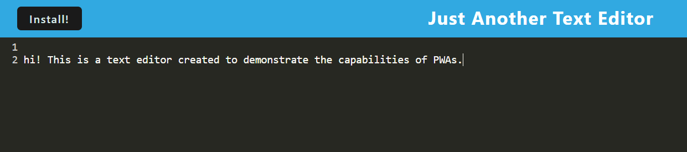

# Just Another Text Editor

## Overview

This application is a text editor used to test the capabilities of Progressive Web Applications. 

## Usage 

The user can type any text they wish and it will be organized by numbered line visible in the interface. Because it is a PWA, the user can refresh of leave the page and return to their text input just as they have left it. 

## Technologies

This application utilizes a client-server model to distribute tasks between servers, as well as a webpack to compile the front-end assets. It is written in Javascript. 

## Credits

The starter code for this application was provided by GitHub user @Xandromus. 

## Heroku Deployment

https://claires-text-editor-40a25f427a49.herokuapp.com/